# EventPass

**Live Site:** https://eventpass-project-arbaz-26c642d141a9.herokuapp.com/

## Table of Contents

- [Overview](#overview)
- [Purpose](#purpose)
- [Target Audience](#target-audience)
- [User Stories](#user-stories)
- [UX / UI Rationale](#ux--ui-rationale)
- [Database Design](#database-design)
- [Features](#features)
- [Page Breakdown](#page-breakdown)
- [Accessibility Features](#accessibility-features)
- [Responsive Design](#responsive-design)
- [Technologies Used](#technologies-used)
- [Testing](#testing)
- [Bugs and Fixes](#bugs-and-fixes)
- [Version Control](#version-control)
- [Deployment](#deployment)
- [Future Improvements](#future-improvements)
- [References](#references)

## Overview

EventPass is a full-stack Django web application built for local event discovery and ticket booking. The website allows users to browse local events, search and filter events, view event details, register for an account, book tickets through Stripe test checkout and view their purchased tickets from their account.

The project is based around events such as music nights, workshops, fitness sessions, charity events, food events and business meetups. The aim is to keep the user journey simple: visitors can browse events first, then create an account when they are ready to book. Once payment is completed, the booking is saved to the user's account.

EventPass is not built as an organiser marketplace. Events, venues, categories, ticket types, orders and cancellation requests are managed by the site owner through the Django admin panel. This keeps the scope more focused and makes the public website easier to use, while still showing CRUD functionality, authentication, payments, admin management and a relational database structure.

Key features include:

- browsing published events
- searching and filtering by event details
- event detail pages with venue information and maps
- account registration, login and logout
- profile updates and password changes
- ticket quantity selection with validation
- Stripe test checkout
- payment success and cancellation pages
- My Tickets page for paid bookings
- support tickets and cancellation requests
- admin management for events, tickets, orders and refunds
- uploaded event images using S3 media storage
- responsive design for desktop and mobile

## Purpose

The purpose of EventPass is to give users one clear place to find and book local events. Smaller events are often shared through social media posts, group chats or separate websites, which can make it harder for users to compare what is available. EventPass brings event information, ticket availability and booking into one platform.

The site is designed to make the booking process easy to follow. Users can browse events without needing an account, view the main details before booking, select ticket quantities, pay through Stripe test checkout and then return to their account to see their tickets. This keeps the process straightforward and avoids making users register before they know whether they are interested in an event.

From a development point of view, the project was built to demonstrate a full-stack Django application with user authentication, relational database models, CRUD features through Django admin, form validation, JavaScript interaction, Stripe payments, media storage, responsive design, accessibility considerations, deployment and testing.

## Target Audience

EventPass is aimed at people who want to find and book local events without having to search across lots of different places. The site is designed for users who want clear event information, simple filtering and a booking process that works well on desktop and mobile.

The main target audience includes:

- **Local event attendees**  
  People looking for music nights, workshops, fitness events, food events, charity nights or business meetups nearby.

- **Registered buyers**  
  Users who want to create an account so they can buy tickets, view their bookings and request help with an order if needed.

- **People looking for specific event types**  
  Users who want to filter events by category, city or price so they can find something that matches their interests.

- **Users who want a simple booking system**  
  People who want to pay for tickets online and have their booking saved to their account instead of relying on messages, screenshots or manual confirmation.

## User Stories

### Visitor Stories

- As a visitor, I want to browse events without creating an account so I can see what is available first.
- As a visitor, I want to search and filter events so I can find events that match my interests.
- As a visitor, I want to view an event detail page so I can see the date, time, venue, ticket price and availability before booking.
- As a visitor, I want to be asked to log in or register before booking so my ticket can be linked to my account.

### Registered User Stories

- As a registered user, I want to log in and log out so my account is protected.
- As a registered user, I want to update my profile details so my account information stays correct.
- As a registered user, I want to change my password so I can keep my account secure.
- As a registered user, I want to choose a ticket type and quantity so I can book the correct tickets.
- As a registered user, I want ticket quantities to be validated so I cannot book more tickets than are available.
- As a registered user, I want to pay through Stripe test checkout so the payment process is clear and realistic.
- As a registered user, I want to see a payment success or cancelled page so I know what happened after checkout.
- As a registered user, I want to view my booked tickets so I can keep track of my orders.
- As a registered user, I want to request help or cancellation for an order so I can contact the site owner if there is a problem.

### Site Owner/Admin Stories

- As the site owner, I want to manage categories, venues and events through Django admin so the public site can stay updated.
- As the site owner, I want to add ticket types and ticket quantities so users can book the correct tickets.
- As the site owner, I want to upload event images so event pages look more complete and realistic.
- As the site owner, I want to view orders so I can see what has been purchased.
- As the site owner, I want to manage support and cancellation requests so user issues can be handled from one place.
- As the site owner, I want to update refund statuses so cancellations and refunded orders are recorded correctly.
- As the site owner, I want regular users to be blocked from admin pages so only authorised users can manage site data.

## UX / UI Rationale

The UX/UI for EventPass was designed around making local event browsing and booking feel clear, modern and easy to follow. The aim was to avoid making the website feel like a basic Django project, so the design uses strong event imagery, a clean navbar, clear event cards, visible buttons and simple forms.

The main user journey was kept simple. Visitors can browse and filter events first, then register or log in only when they want to book tickets. This avoids forcing users to create an account before they know whether they are interested in an event.

The site is not designed as an organiser marketplace. This affected the interface because public users do not need organiser dashboards, create-event forms or edit-event pages. Instead, the public side focuses on browsing events, booking tickets, managing account details and getting help with an order. Event and ticket management is kept in Django admin for the site owner.

The pages were also planned so users can scan information quickly. Event cards show the image, category, date, city, price and availability before the user opens the detail page. This is important for an event website because users usually compare a few options before deciding what to book.

I also tried to reduce cognitive overload by keeping each page focused on one main task. For example, the events page is for browsing and filtering, the event detail page is for checking event information, and the booking page is for choosing ticket quantities. I also followed Fitts's Law by making the main buttons large and easy to click or tap, especially actions like Browse Events, Book Tickets, Continue to Payment and View My Tickets.

### Project Planning

The project was planned around a simpler site-owner event model. At first, the idea could have become an organiser marketplace where different organisers create and manage events, but this would have added a lot of extra permissions and dashboard work.

The final plan was to make the site owner manage events through Django admin, while public users browse and buy tickets through the public website. This made the project easier to control and allowed more time to focus on the booking journey, payment flow, responsive design and testing.

The main user journey planned was:

1. Site owner adds events and ticket types in Django admin.
2. Visitor browses published events.
3. Visitor searches or filters events.
4. Visitor registers or logs in when they want to book.
5. User selects ticket quantities.
6. User pays through Stripe test checkout.
7. Booking appears in My Tickets.
8. User can request support or cancellation if needed.

#### Project Timeline

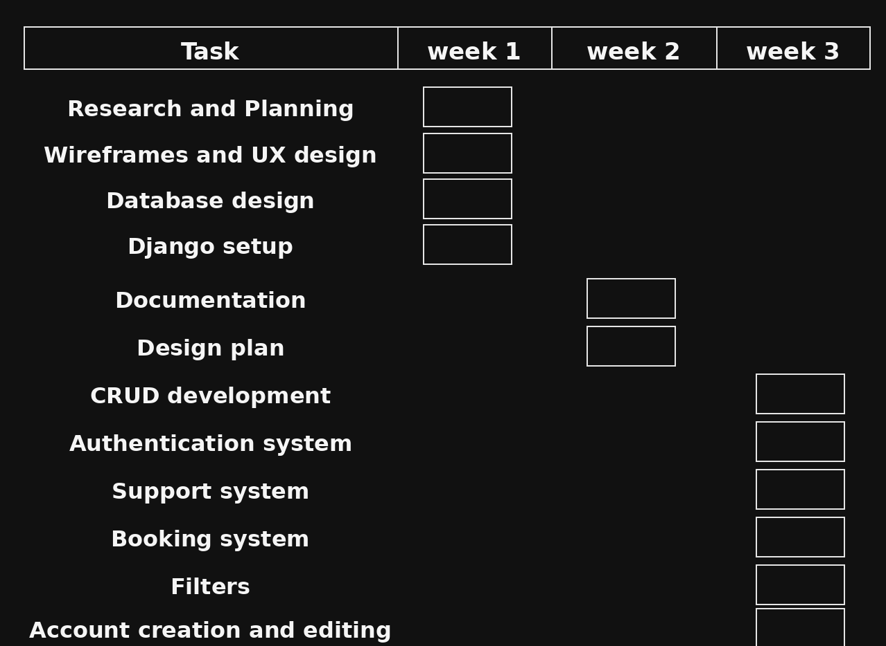

This timeline was used to plan the main stages of the project, including research, wireframes, Django setup, authentication, CRUD features, booking, support and documentation.

### Wireframes

Simple wireframes were used to plan the main page structure before building the final styling. These were kept basic so the focus stayed on layout, navigation and user flow rather than colours or images at the start.

The main pages planned were:

- homepage with carousel, featured events and category links
- events page with search and filters
- event detail page with venue and ticket information
- register and login pages
- booking page with ticket quantities
- My Tickets page
- support ticket pages

These layouts helped decide where the main buttons should go, especially on the event detail and booking pages where the user needs a clear path from viewing an event to completing checkout.

#### Homepage Wireframe

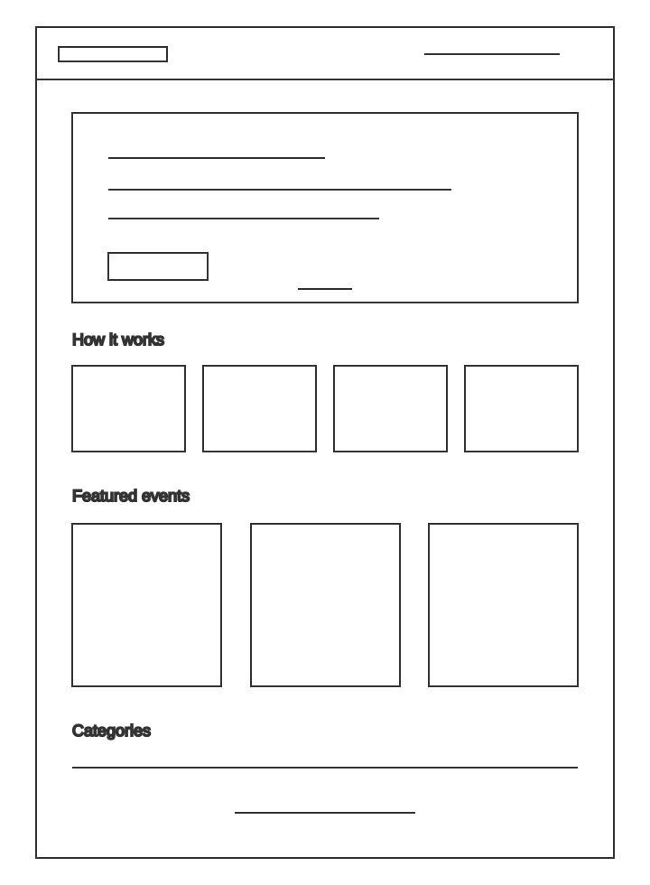

#### Events Page Wireframe

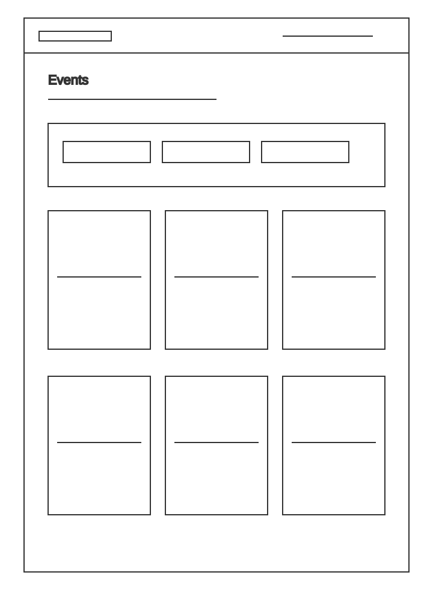

#### Event Detail Wireframe

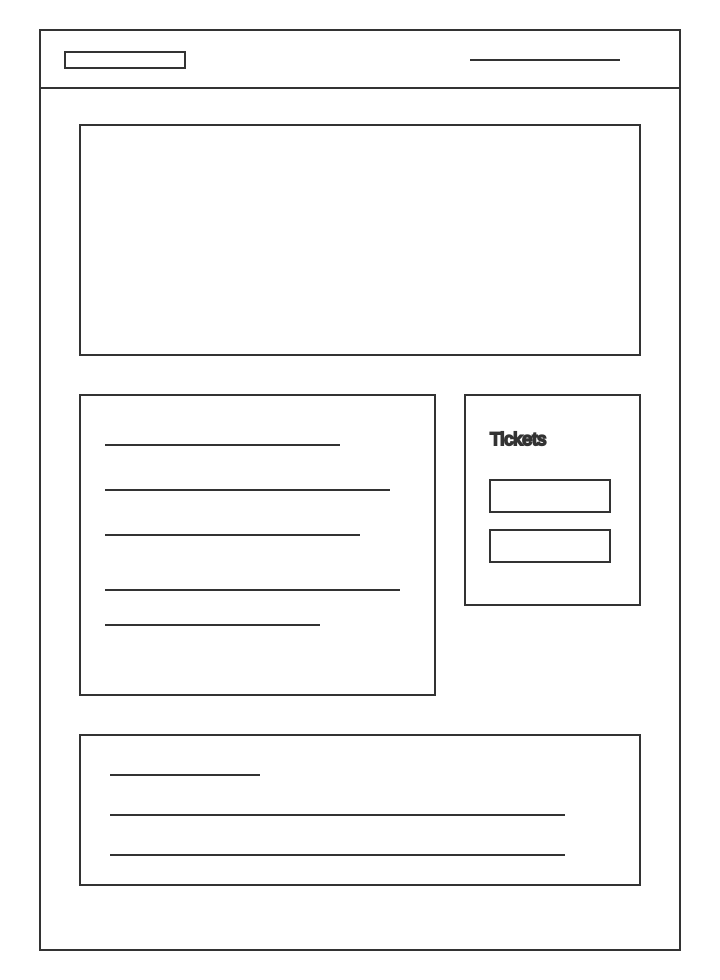

#### Booking Page Wireframe

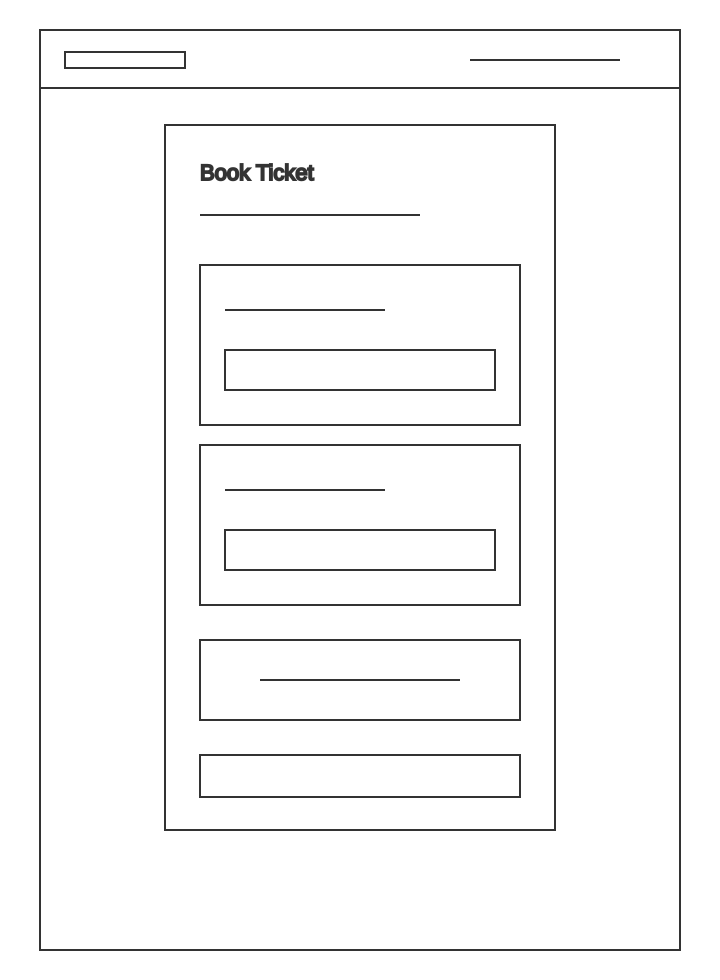

### Design Tokens

Design tokens were used to keep the styling consistent across the website. Instead of choosing colours and spacing separately on each page, I placed the main style values in the CSS file and reused them throughout the project.

The main tokens included:

- dark navy background colour
- coral action colour
- purple highlight colour
- off-white page background
- muted text colour
- border colour
- card border radius
- reusable button styling
- reusable form styling

This helped keep the design consistent because the same colours, buttons, cards and panels are reused across the homepage, events page, booking page, profile page, support pages and payment pages.

### Colour Palette

The colour palette was planned before styling the site so the design could stay consistent across the project.

The visual style is based around a ticket and live-event theme. The dark navy header gives the site a professional base, while the coral accent colour is used for key actions such as Register, Browse Events, Book Tickets and payment buttons. Purple is used more lightly for category badges and small highlights, which fits the live-event/stage lighting style without making the whole page too busy.

### Visual Hierarchy

Visual hierarchy was important because the website includes browsing, filtering, booking, payments and support features. To keep this clear, I used large headings, card sections, spacing and strong button colours.

The homepage carousel uses large text and a clear button so users immediately understand the main purpose of the site. Event cards are image-led so users can first recognise the type of event, then read the title, date, city, price and availability.

The booking page was also kept focused. Ticket types are shown in a list, quantity controls sit beside each ticket, and the total updates underneath. The main checkout button uses the coral colour, while secondary actions use dark buttons so the main action is easier to spot.

Payment and confirmation pages use centred cards because these pages need to give clear feedback. The user should quickly understand whether the payment worked, what order was created and where to view their tickets.

### Navigation

The layout uses a simple structure with a clear header, main content area and footer. The navbar stays consistent across the site and changes depending on whether the user is logged in or logged out. Logged-out users see Login and Register, while logged-in users see Profile, Support and Logout.

On smaller screens, the navbar collapses into a Bootstrap hamburger menu. This keeps the header clean on mobile and avoids crowding the navigation links.

### Forms and Booking Flow

Forms were kept simple with clear labels, full-width inputs and large buttons. This was important for registration, login, profile updates, support tickets and booking. The booking page also uses JavaScript to update the ticket total and prevent users from continuing with invalid quantities.

The payment flow was designed to give clear feedback. Users are sent to Stripe test checkout, then returned to either a payment success page or a payment cancelled page. This gives the user a clear result instead of leaving them unsure about what happened.

### Responsive Design

The site was built to work on desktop and mobile. Event cards stack on smaller screens, forms stay full width, and buttons remain large enough to tap. This is important because users may browse or book local events from their phone.

### Accessibility Considerations

Accessibility was considered by using readable colours, clear labels, alt text for important images, aria labels for icon links, visible button text and responsive layouts. The carousel images are used as decorative background images, while the important meaning is provided through visible headings, text and buttons.

## Database Design

The database was designed around the main event booking system. The `Event` model is the central model because most of the other data connects back to an event, such as ticket types, orders and venues. I planned it this way because the website is mainly based around users being able to browse events, book tickets and view their orders.

EventPass is not an organiser marketplace, so there is no organiser field on the event model. Events are created and managed by the site owner through Django admin. This keeps the database cleaner and matches the final scope of the project.

The diagram below shows the main relationships between the models. It is a simplified ER diagram, so it focuses on the core structure rather than showing every extra field used later for payments, uploaded images and admin handling.

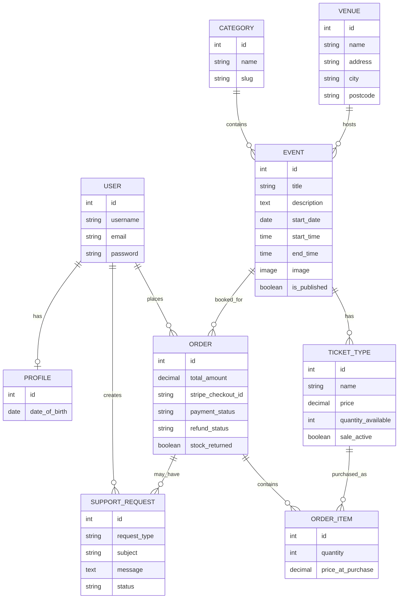
```mermaid
erDiagram
    USER ||--o| PROFILE : has
    USER ||--o{ ORDER : places
    USER ||--o{ SUPPORT_REQUEST : creates

    CATEGORY ||--o{ EVENT : contains
    VENUE ||--o{ EVENT : hosts
    EVENT ||--o{ TICKET_TYPE : has
    EVENT ||--o{ ORDER : booked_for

    ORDER ||--o{ ORDER_ITEM : contains
    TICKET_TYPE ||--o{ ORDER_ITEM : purchased_as
    ORDER ||--o{ SUPPORT_REQUEST : may_have

    USER {
        int id
        string username
        string email
        string password
    }

    PROFILE {
        int id
        date date_of_birth
    }

    CATEGORY {
        int id
        string name
        string slug
    }

    VENUE {
        int id
        string name
        string address
        string city
        string postcode
    }

    EVENT {
        int id
        string title
        text description
        date start_date
        time start_time
        time end_time
        image image
        boolean is_published
    }

    TICKET_TYPE {
        int id
        string name
        decimal price
        int quantity_available
        boolean sale_active
    }

    ORDER {
        int id
        decimal total_amount
        string stripe_checkout_id
        string payment_status
        string refund_status
        boolean stock_returned
    }

    ORDER_ITEM {
        int id
        int quantity
        decimal price_at_purchase
    }

    SUPPORT_REQUEST {
        int id
        string request_type
        string subject
        text message
        string status
    }
```

### Model Breakdown

| Model | Purpose | Important Fields | Relationship |
|-------|---------|------------------|--------------|
| `User` | Handles user accounts using Django's built-in user model. | username, email, password | A user can place orders and create support requests. |
| `Profile` | Stores extra account details. | user, date_of_birth | Each profile belongs to one user and is used for profile updates and age checks. |
| `Category` | Stores event categories such as Music, Food and Workshop. | name, slug | One category can have many events. |
| `Venue` | Stores where an event takes place. | name, address, city, postcode | One venue can host many events. |
| `Event` | Stores the main event information shown on the public website. | category, venue, title, description, start_date, start_time, end_time, image, is_published | Each event belongs to one category and one venue, and can have many ticket types and orders. |
| `TicketType` | Stores the tickets available for each event. | event, name, price, quantity_available, sale_active | Each ticket type belongs to one event and can appear in order items. |
| `Order` | Stores a user's paid booking. | user, event, total_amount, payment_status, refund_status | Each order belongs to one user and one event. |
| `OrderItem` | Stores the tickets inside an order. | order, ticket_type, quantity, price_at_purchase | Each order item belongs to one order and one ticket type. |
| `SupportRequest` | Stores help requests from users. | user, order, request_type, subject, message, status | A support request belongs to one user and can optionally be linked to an order. |
| `CancellationRequest` | Shows cancellation requests separately in admin. | user, order, status, refund_status | Uses the support request data but makes cancellation requests easier for the site owner to manage. |

### Main Relationships

- One user can have one profile.
- One user can place many orders.
- One user can create many support requests.
- One category can have many events.
- One venue can have many events.
- One event can have many ticket types.
- One event can have many orders.
- One order can have many order items.
- One ticket type can appear in many order items.
- One order can have support or cancellation requests linked to it.

### Database Constraints

I also added validation and checks to keep the data cleaner:

- Event slugs are unique so event/category links stay clean.
- Only published events are shown on the public event pages.
- Ticket quantities are checked before checkout.
- Users cannot continue with zero tickets.
- Users cannot book more tickets than the available stock.
- Users under 16 are blocked from registering.
- Paid bookings are stored after successful Stripe checkout.
- Refunded orders return ticket stock so the event availability stays correct.

### CRUD and Data Handling

The project uses the database for more than just displaying static content. Users can register, update their profile details, change their password, book tickets, view their orders and create support or cancellation requests.

The site owner can also create, read, update and delete categories, venues, events and ticket types through Django admin. Orders, refunds, support tickets and cancellation requests can also be managed through admin. This shows data being created, read, updated and deleted through the public website and the admin panel.

Ticket stock is stored in the database as well. Ticket quantities are checked before checkout, reduced after successful payment and returned if an order is refunded. This helps stop users from booking tickets that are no longer available.

## Features

### Existing Features

- Homepage with Bootstrap carousel
- Featured events section
- Popular category links
- How it works section
- Event listing page
- Event detail page
- Search and filtering
- Sold out event badges
- Ticket availability display
- Ticket quantity validation
- Stripe test checkout
- Payment success page
- Booking confirmation emails
- Payment cancelled page
- Booking confirmation page
- My Tickets page
- Signup, login and logout
- Automatic login after registration
- Age check on registration
- Profile update form
- Password change form
- Support ticket create, edit and delete
- Cancellation requests
- Admin event management
- Admin ticket type management
- Admin order and refund management
- Uploaded event images
- S3 media storage
- Custom 404 and 500 pages
- Responsive navbar and footer
- Basic JavaScript animations and booking updates

## Page Breakdown

### Home Page

The home page introduces EventPass and gives users a clear starting point. It uses a Bootstrap carousel, event imagery and call-to-action buttons so users can either browse events or register for an account.

The page also includes featured events, popular categories and a short how it works section. This gives users a quick idea of what the site does without making the homepage too long.

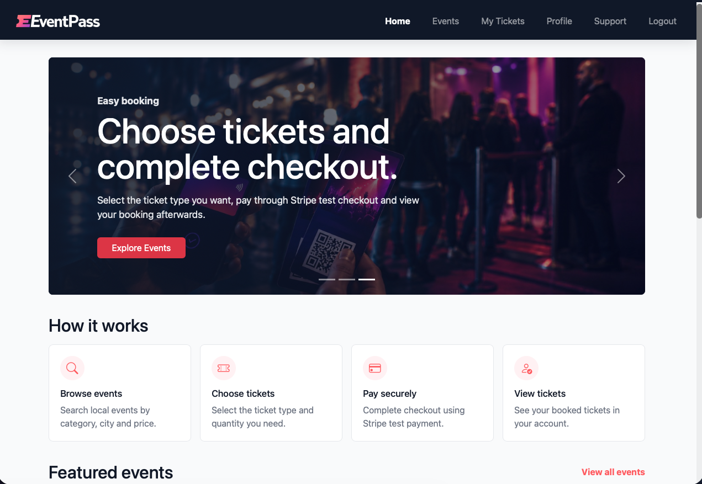

### Events Page

The events page is where users can browse the published events. It includes search, category filtering, city filtering and price filtering. Each card shows the event image, category, date, city, ticket price and ticket availability.

Sold out events are still shown, but they are marked clearly so users know they cannot book those tickets.

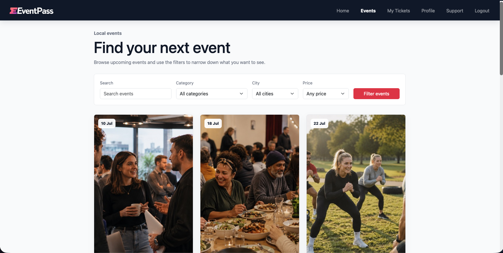

### Event Detail Page

The event detail page shows more information about one event. It includes the event image, description, date, time, venue details, ticket types and a map for the venue location.

If tickets are available, users can continue to the booking page. If the event is sold out, the page makes this clear instead of showing a normal booking option.

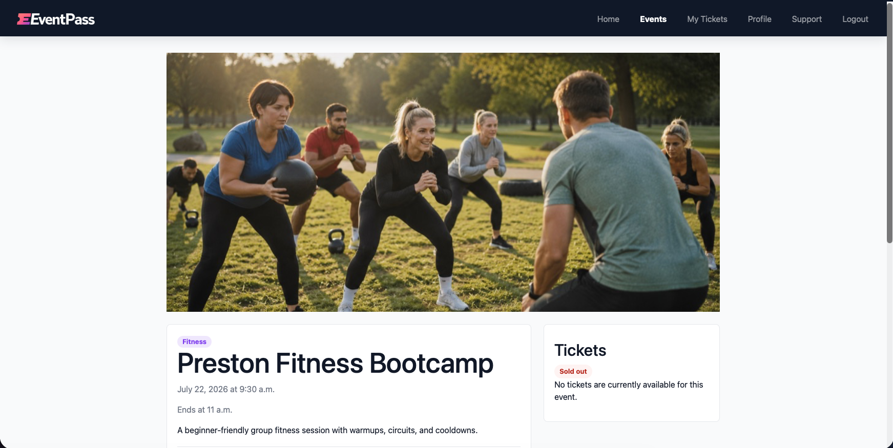

### Register Page

The register page lets new users create an account. The form collects username, name, email, date of birth and password details. Users under 16 are blocked from registering, and users are logged in automatically after a successful signup.

### Login Page

The login page lets existing users access their account. Protected pages such as booking, My Tickets, Profile and Support require the user to be logged in.

### Profile Page

The profile page lets logged-in users update their name, email address and date of birth. It also links users to the password change page so account details are kept separate from password updates.

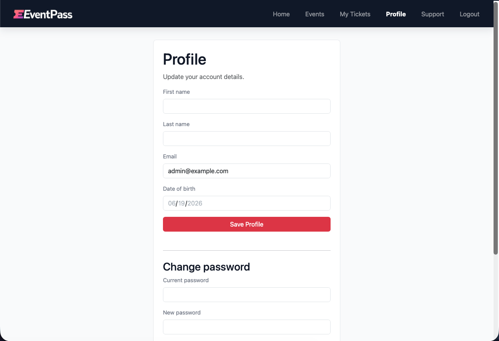

### Booking Page

The booking page lets users choose ticket quantities before going to Stripe checkout. JavaScript updates the total price on the page, and the form checks that users cannot continue with zero tickets or more tickets than are available.

### Payment Pages

The payment success page confirms that the payment has been completed and shows the order summary. A booking confirmation email is also sent to the user's account email address after a successful payment. The payment cancelled page gives users a clear message if checkout is cancelled and lets them return to events.

### Booking Confirmation Page

The booking confirmation page shows the confirmed order details, including the event, order number, ticket quantity, total price and ticket status. It also tells users that tickets will be emailed before the event start date.

### My Tickets Page

The My Tickets page shows the user's paid bookings. It also shows cancellation or refund information if an order has a request linked to it.

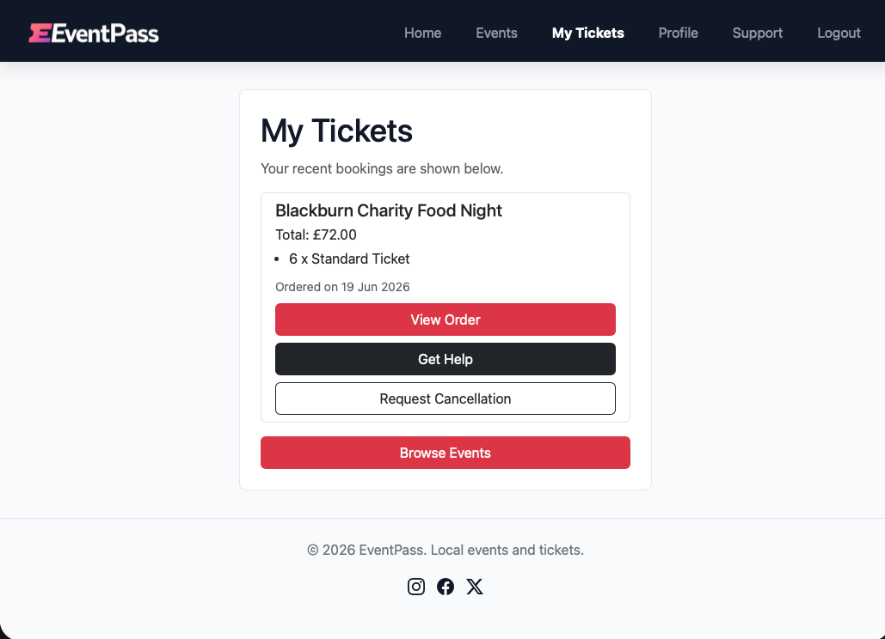

### Support Pages

The support pages let logged-in users create, edit and delete support tickets. Users can also request cancellation for an order, which is then managed separately by the site owner in admin.

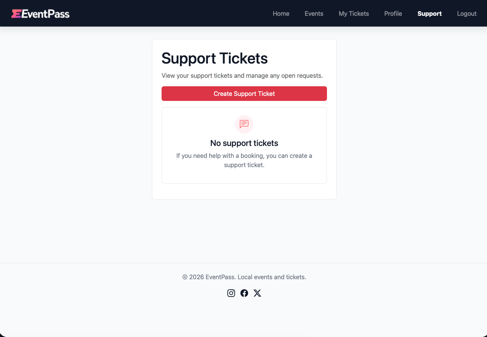

### Admin Area

The admin area is used by the site owner to manage the website content and booking data. Categories, venues, events, ticket types, orders, refunds, support tickets and cancellation requests are all managed through Django admin.

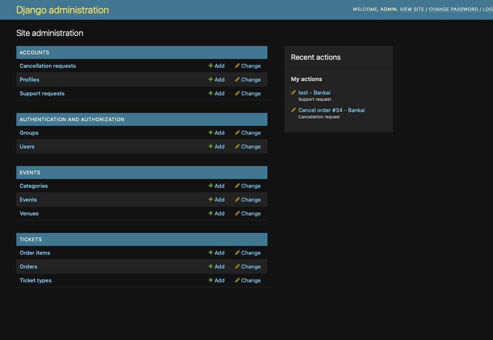

### Error Pages

Custom 404 and 500 pages are included so users get a styled page if something goes wrong or a page cannot be found.

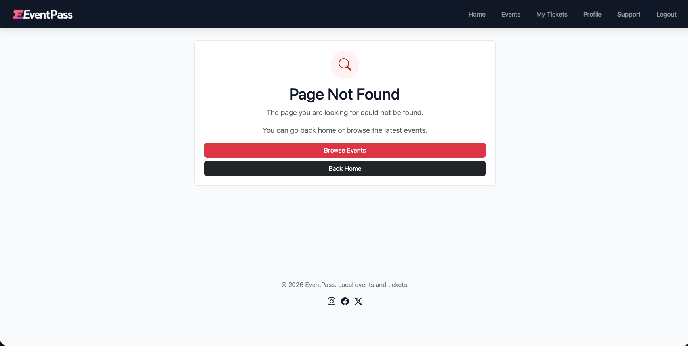

## Accessibility Features

Accessibility was considered throughout the project so the site is easier to use and understand. I kept the accessibility work simple and relevant rather than adding unnecessary ARIA everywhere.

- **Semantic HTML structure**  
Pages use normal headings, links, buttons, forms and sections where possible, so the structure is easier to follow.

- **Clear page headings**  
Each main page has a clear heading so users can quickly understand what page they are on, such as Events, My Tickets, Profile and Support Tickets.

- **Image alt text**  
Important images, such as the logo, event card images and event detail images, include alt text. The carousel images are used as background images because the slide text already explains the content.

- **Icon-only links**  
Icon-only links, such as footer social icons, include accessible labels so the purpose of the link is still clear.

- **Clear button text**  
Most buttons use visible text such as Browse Events, View Details, Book Tickets, Pay with Stripe, View My Tickets and Create Support Ticket, so users can understand the action without guessing.

- **External social links**  
Footer social links open in a new tab and include `rel="noopener noreferrer"` for safer external linking.

- **Form labels**  
Forms include labels for fields such as username, email, date of birth, password and ticket quantity. This makes the forms easier to understand and also helps with accessibility.

- **Colour contrast**  
The project uses a dark navy header with light text and coral action buttons. This was chosen to keep the design readable while still matching the event/ticket style.

- **Keyboard use**  
The main links, buttons, form fields and dropdown menu can be reached using the keyboard. This helps users who do not use a mouse.

- **Responsive layout**  
The layout adapts for smaller screens, and the navbar becomes a hamburger menu on mobile so links do not become crowded.

## Responsive Design

The website was built to work across desktop, tablet and mobile screen sizes. This was important because users may browse events or book tickets while using their phone.

Bootstrap was used for some of the layout and responsive behaviour, especially the navbar. On smaller screens, the desktop navigation changes into a hamburger menu so the links do not overcrowd the top of the page.

The event cards were also designed to adapt to smaller screens. On desktop, the cards sit in a grid with event images and key details. On mobile, the cards stack naturally so the title, date, city, price and buttons remain readable.

Forms were also considered for smaller screens. Inputs, buttons and ticket quantity controls use larger spacing so they are easier to tap on mobile. This is especially useful on the register, profile, support and booking pages.

The booking and payment pages use centred cards on larger screens, but still fit smaller mobile screens without horizontal scrolling. This keeps the checkout journey simple and readable.

Custom CSS media queries were used alongside Bootstrap to adjust spacing, image sizing, navbar layout, carousel height and card behaviour. This helped keep the site consistent without needing to create separate pages for mobile and desktop.

## Technologies Used

- HTML5
- CSS3
- JavaScript
- Bootstrap
- Bootstrap Icons
- Python
- Django
- SQLite
- PostgreSQL / Heroku Postgres
- Stripe
- AWS S3
- Django Storages
- Boto3
- LottieFiles / DotLottie player
- Git and GitHub
- Heroku

## Testing

### Testing Approach

Testing was mainly carried out manually by using the website in the browser and checking each feature as it was added. This suited the project because a lot of the functionality depends on user interaction, forms, authentication, search filters, ticket quantities, Stripe checkout, support requests and admin updates.

Manual testing allowed me to check the project from a user's point of view. For example, I could test whether a user could register, log in, browse events, choose tickets, complete checkout, view their tickets and request support for an order.

I also checked the website across different screen sizes and browsers. The main testing was done in Chrome, with additional checks in Safari because this is the browser I commonly use on my Mac. Mobile responsiveness was tested by resizing the browser window and using browser developer tools to check smaller screen widths. This helped me spot issues with the navbar, event cards, booking form and payment pages on mobile.

I also tested the project during deployment because the local version and Heroku version use different environments. Locally the project uses SQLite, while the deployed version uses Heroku Postgres and S3 media storage. This meant I had to check migrations, environment variables, static files, uploaded images and Stripe settings separately on Heroku.

Alongside manual testing, I also checked that the Django project loaded correctly and that the static files and media files worked properly before and after deployment.

### Manual Testing

#### Navigation

| Test Area | Test Case | Steps | Expected Result | Actual Result |
|----------|-----------|-------|----------------|---------------|
| Main navigation | Header links work on desktop and mobile | Test Home, Events, My Tickets, Login, Register and the mobile menu | Pages load correctly and protected pages redirect to login where needed | Pass |
| Footer links | Social links open externally | Click Instagram, Facebook and X footer icons | Links open in a new tab and use safe external link attributes | Pass |

#### Events

| Test Area | Test Case | Steps | Expected Result | Actual Result |
|----------|-----------|-------|----------------|---------------|
| Event browsing | Published events display correctly | Open Home, Events and an event detail page | Event cards, images, venue details and ticket information display correctly | Pass |
| Search and filters | Users can narrow event results | Use search, category, city and price filters | Results update to match the selected search/filter options | Pass |
| Homepage carousel and animations | Interactive homepage elements work | Use carousel controls and hover over event cards | Carousel changes slide and cards animate smoothly on hover | Pass |
| Sold out events | Sold out events cannot be booked | Open a sold out event and its booking page | Sold out message is shown and no purchase option is available | Pass |

#### Accounts

| Test Area | Test Case | Steps | Expected Result | Actual Result |
|----------|-----------|-------|----------------|---------------|
| Registration | New users can create an account | Submit the register form with valid details | Account is created and user is logged in automatically | Pass |
| Registration validation | Invalid registration details are blocked | Try under-16 date of birth and duplicate email | Form shows errors and account is not created | Pass |
| Profile updates | Users can manage account details | Update name, email and date of birth on the profile page | Details save and invalid email/age changes are blocked | Pass |
| Password change | User can change password safely | Test valid password change and incorrect current password | Valid password updates, incorrect current password is blocked | Pass |
| Logout | User can log out | Click Logout from the navbar | User is logged out and returned to the homepage | Pass |

#### Booking and Payments

| Test Area | Test Case | Steps | Expected Result | Actual Result |
|----------|-----------|-------|----------------|---------------|
| Booking access | Only logged-in users can book | Try opening booking page while logged out | User is redirected to login | Pass |
| Booking validation | Ticket quantity is controlled | Try 0 tickets and a quantity above available stock | Checkout is blocked for 0 tickets and quantity cannot go above stock | Pass |
| Stripe checkout | Test payment works | Select a ticket and complete Stripe test checkout | User returns to payment success page and order is created | Pass |
| Email confirmation | Booking confirmation email is sent | Complete a Stripe test payment with a user that has an email address | Confirmation email is sent and the order is marked as email confirmation sent | Pass |
| Booking confirmation | Paid tickets show in account | Open confirmation page and My Tickets after payment | Order details and ticket information display correctly | Pass |
| Payment cancelled page | Cancel page displays correctly | Open `/payments/cancel/` | Payment Cancelled page displays with Browse Events and Back Home links | Pass |

#### Support and Cancellations

| Test Area | Test Case | Steps | Expected Result | Actual Result |
|----------|-----------|-------|----------------|---------------|
| Support requests | User can manage support tickets | Create, edit and delete a support ticket | Support ticket is saved, updated and removed correctly | Pass |
| Cancellation requests | User can request order cancellation | Request cancellation from a paid order | Cancellation request is linked to the order and ticket shows Refund Requested | Pass |

#### Responsive and Error Pages

| Test Area | Test Case | Steps | Expected Result | Actual Result |
|----------|-----------|-------|----------------|---------------|
| Responsive layout | Main pages work on mobile | Test Home, Events, Booking, Profile and Payment Cancelled at 390px and 360px widths | Content stacks correctly without horizontal scrolling | Pass |
| Custom 404 page | Invalid URL handled correctly | Open a non-existent page URL | Custom Page Not Found page is shown with links back to events and home | Pass |

#### Admin

| Test Area | Test Case | Steps | Expected Result | Actual Result |
|----------|-----------|-------|----------------|---------------|
| Admin access | Normal user cannot access admin | Open `/admin/` while logged in as a normal user | Admin login page blocks access and asks for an authorised account | Pass |
| Admin login | Superuser can access admin | Log in to `/admin/` using the admin account | Django admin dashboard opens successfully | Pass |
| Admin management | Site owner can manage records | Check events, ticket types, orders, support requests and cancellation requests in admin | Main records are visible and manageable through the admin panel | Pass |
| Event image upload | Site owner can upload event images | Upload an image to an event in admin and view the event page | Uploaded image displays on the public event page | Pass |
| Refund handling | Site owner can process refunds | Change an order refund status in admin | Refund status updates and ticket stock is returned when refunded | Pass |

#### Deployment and Browser Testing

| Test Area | Test Case | Steps | Expected Result | Actual Result |
|----------|-----------|-------|----------------|---------------|
| Heroku deployment | Live pages return successfully | Check the home page and events page on Heroku | Both pages load successfully | Pass |
| Browser testing | Key pages load in different browsers | Open Home, Events and Login in Safari and Chrome | Pages load successfully in both browsers | Pass |
| S3 media storage | Uploaded media storage works | Save and delete a temporary file through Django default storage on Heroku | File is saved to the S3 bucket and then deleted successfully | Pass |

### Mobile Testing

| Test Area | Steps | Expected Result | Actual Result |
|----------|-------|----------------|---------------|
| Mobile navigation | Open the site at mobile width and use the hamburger menu | Menu opens, closes and all links are usable | Pass |
| Homepage mobile layout | View the carousel, featured events and category links on mobile | Content stacks neatly and buttons remain easy to tap | Pass |
| Event list mobile layout | Open the events page and use search/filter controls | Filters stack correctly and event cards remain readable | Pass |
| Event detail mobile layout | Open an event detail page | Event image, venue details, map and ticket panel stack correctly | Pass |
| Booking mobile layout | Open the booking page and use quantity buttons | Quantity controls and payment button remain usable | Pass |
| Account forms on mobile | Open Register, Login and Profile pages | Form fields fit the screen and labels remain readable | Pass |
| Support pages on mobile | Open support list and support form | Support tickets and form controls display correctly | Pass |
| Payment pages on mobile | Open payment success, payment cancelled and booking confirmation pages | Cards, buttons and payment animation fit the screen | Pass |
| Footer on mobile | Scroll to the footer and test social icons | Footer icons are visible and links remain tappable | Pass |

#### Mobile Homepage

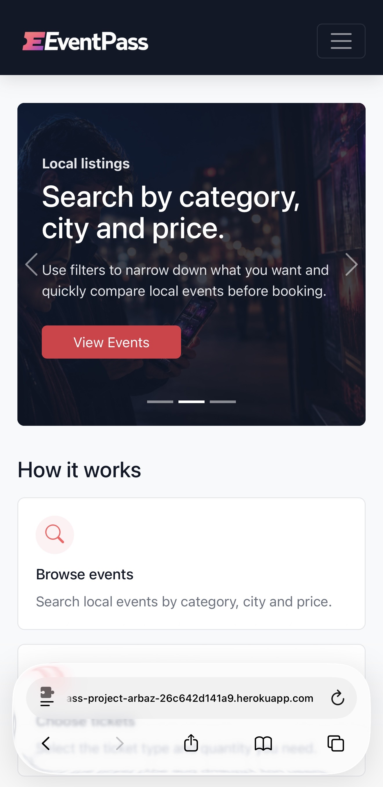

The mobile homepage was checked with the hamburger menu closed. The logo, carousel, call-to-action button and content cards resized correctly.

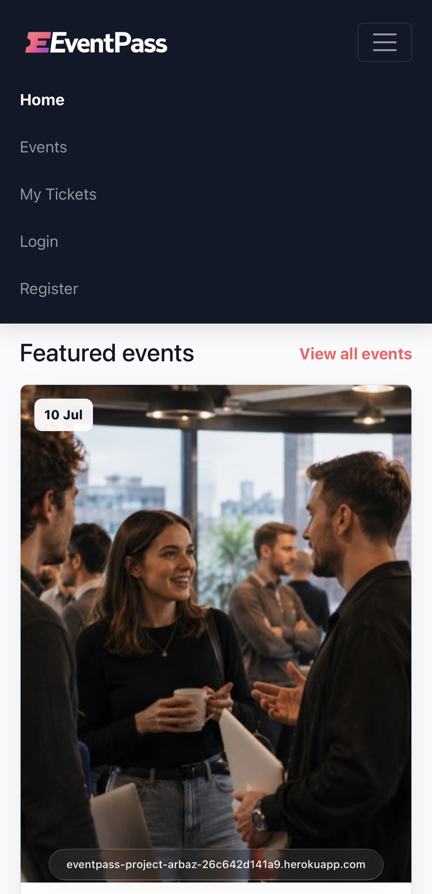

The mobile navigation was also checked with the hamburger menu open. The menu links displayed clearly and remained easy to tap.

#### Mobile Events Page

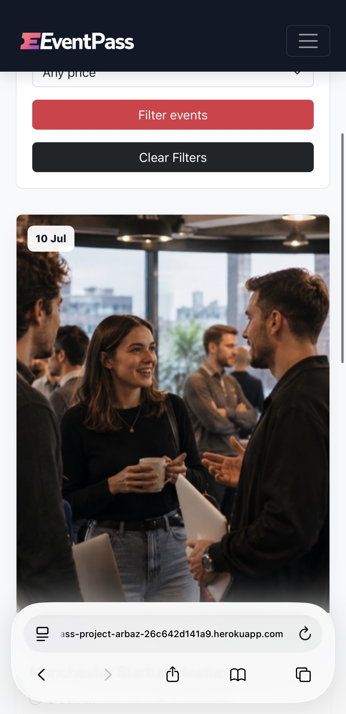

The events page was checked on mobile. The filter controls stacked correctly and the event cards stayed readable on a smaller screen.

#### Mobile Event Detail Page

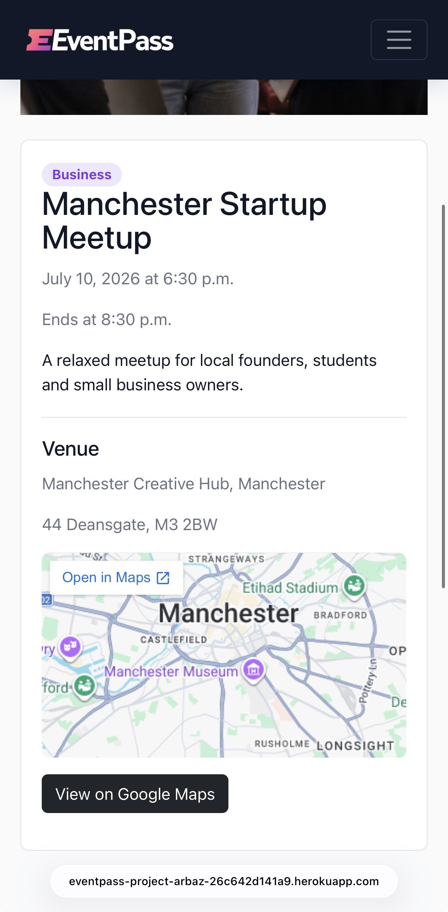

The event detail page was checked on mobile. The event information, venue section, map and action buttons stayed readable.

#### Mobile Booking Page

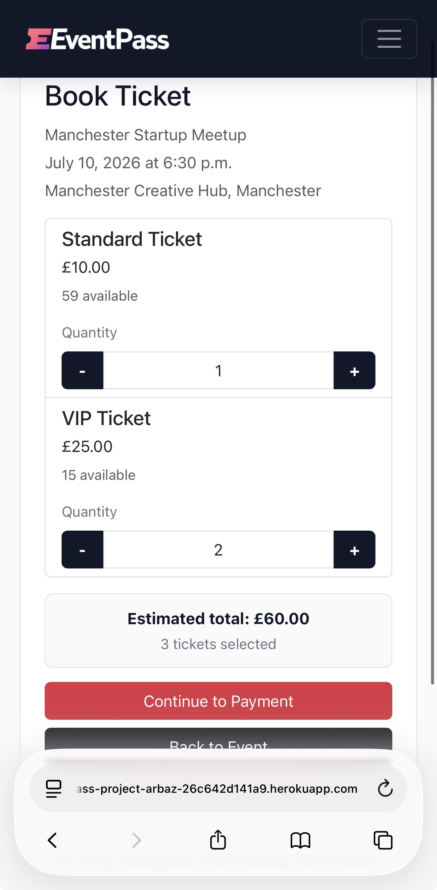

The booking page was checked on mobile. The ticket quantity controls, estimated total and payment button remained easy to use.

#### Mobile Payment Success Page

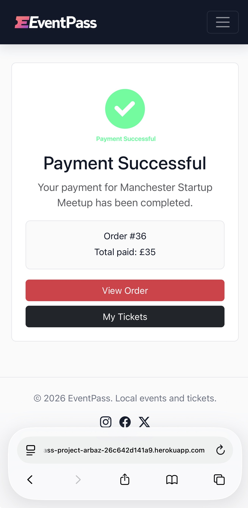

The payment success page was checked on mobile after completing a Stripe test payment. The confirmation card, animation and buttons displayed correctly.

### Accessibility Testing

| Test Area | What Was Checked | Result |
|----------|------------------|--------|
| Image alt text | Logo, event card images and event detail images were checked for alt text | Pass |
| Decorative images | Carousel images are used as background images because the visible text already explains each slide | Pass |
| Motion settings | Reduced motion CSS is included for users who prefer less movement | Pass |
| Navigation labels | Navbar has a main navigation label and the mobile menu button has a toggle label | Pass |
| Social icon links | Instagram, Facebook and X icons have aria labels so they can be understood by screen readers | Pass |
| External links | Footer social links and Google Maps links open in a new tab with safe external link attributes | Pass |
| Form labels | Register, login, profile, event filter, booking and support forms have visible labels | Pass |
| Keyboard use | Main links, buttons, form fields, carousel controls and mobile menu can be reached and used with keyboard controls | Pass |
| Responsive layout | Pages were checked at desktop, 390px mobile width and 360px mobile width | Pass |

### User Story Verification

| User Story | How It Was Met |
|------------|----------------|
| As a visitor, I want to browse events without creating an account so I can see what is available first. | Published events can be viewed on the homepage, events page and event detail pages without logging in. |
| As a visitor, I want to search and filter events so I can find events that match my interests. | The events page includes search, category, city and price filters. |
| As a visitor, I want to view event details before booking. | Each event card links to a detail page with description, date, time, venue, tickets and map information. |
| As a visitor, I want to be asked to log in or register before booking. | Booking pages require login, so logged-out users are redirected before checkout. |
| As a registered user, I want to log in and log out so my account is protected. | Login and logout links are included in the navbar and the navbar changes depending on authentication state. |
| As a registered user, I want to update my profile details. | The profile page lets users update their name, email address and date of birth. |
| As a registered user, I want to change my password. | A password change form is available from the profile area. |
| As a registered user, I want to choose a ticket type and quantity. | The booking page lists available ticket types and lets users select ticket quantities. |
| As a registered user, I want ticket quantities to be validated. | The booking form blocks zero tickets and quantities above available stock. |
| As a registered user, I want to pay through Stripe test checkout. | Users are redirected to Stripe test checkout and returned to EventPass after payment. |
| As a registered user, I want to see a payment result page. | Payment success and payment cancelled pages give clear feedback after checkout. |
| As a registered user, I want to view my booked tickets. | The My Tickets page shows paid orders for the logged-in user. |
| As a registered user, I want to request help or cancellation for an order. | Users can create support tickets and request cancellation from eligible orders. |
| As the site owner, I want to manage events through admin. | Categories, venues, events and ticket types are managed through Django admin. |
| As the site owner, I want to manage orders and refunds. | Orders, refund statuses and cancellation requests can be managed through admin. |
| As the site owner, I want normal users blocked from admin. | Normal users cannot access the admin dashboard without authorised staff/superuser access. |

### Validation

| Check | Tool / Method | Result |
|-------|---------------|--------|
| Accessibility score | Lighthouse | Pass - Accessibility scored 100 |
| SEO checks | Lighthouse and manual review | Meta description added and main pages have clear headings |
| HTML validation | Nu Html Checker | No errors or warnings found |
| CSS validation | W3C CSS Validator | No errors found |
| Image delivery | Lighthouse and manual review | Large PNG images were replaced with smaller JPEG versions where needed |
| Browser check | Chrome and Safari | Main pages loaded successfully in both browsers |
| Mobile check | Browser developer tools | Main pages worked at 390px and 360px widths |
| Internal links | Live site link check | Internal links checked successfully with no broken links found |
| Commented-out code | Manual/codebase check | No unused commented-out code was found |
| Production security | Heroku config check | `DEBUG` is turned off on the deployed site |
| Secret values | Git/config check | Secret values are stored in environment settings and not committed to the repository |

#### Lighthouse Desktop

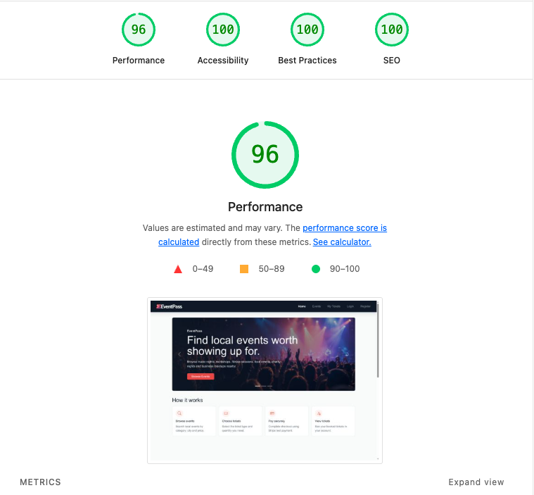

The deployed homepage scored 96 for Performance and 100 for Accessibility, Best Practices and SEO.

#### Lighthouse Mobile

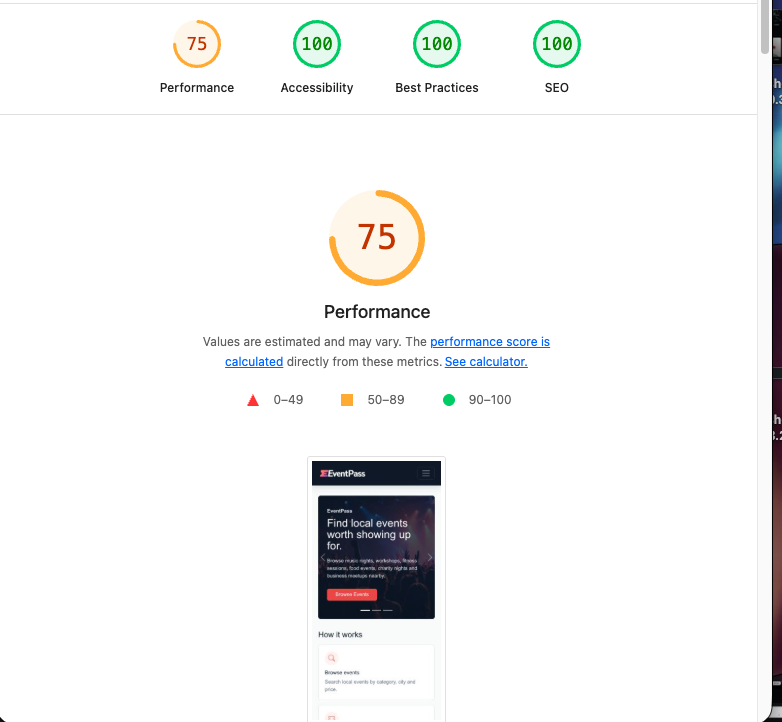

The deployed homepage scored 75 for Performance and 100 for Accessibility, Best Practices and SEO. The mobile performance score was lower mainly because of image delivery and external CSS files.

#### HTML Validation

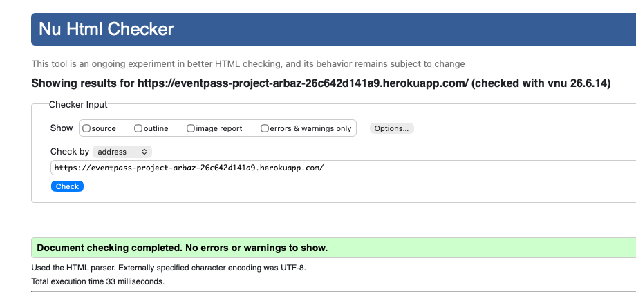

The deployed homepage was checked with the Nu Html Checker and no errors or warnings were found.

#### CSS Validation

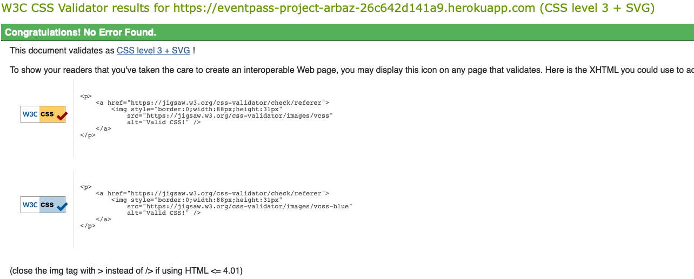

The deployed homepage was checked with the W3C CSS Validator and no errors were found.

## Bugs and Fixes

| Bug | Cause | Fix |
|-----|-------|-----|
| Navbar layout was not aligned properly | Logo, nav links and logout button had different spacing and alignment | Adjusted navbar styling so the logo, links and logout button sit correctly |
| Mobile menu spacing looked awkward | The navbar was too tall and the menu spacing did not feel balanced on smaller screens | Slimmed down the navbar and checked the hamburger menu on mobile widths |
| Carousel buttons were hard to click | The carousel layer and button positioning made the hero buttons unreliable | Adjusted carousel layering so the call-to-action buttons could be clicked normally |
| Stripe success page caused an error | The success view was reading the Stripe session in the wrong way | Updated the payment success logic so the order can be found correctly after checkout |
| Payment success page spacing looked wrong | The success animation and text had too much empty space around them | Adjusted the layout so the confirmation screen is neater |
| Payment success animation looked too small | The Lottie animation did not stand out enough on the confirmation page | Increased the animation size and adjusted the surrounding spacing |
| Payment success animation was not centred properly on mobile | The animation was positioned with margin values instead of being centred inside its container | Updated the animation frame so it centres the animation properly |
| Booking flow created unpaid orders | Orders were being created before payment was complete | Changed the flow so orders are created after successful Stripe payment |
| Ticket quantity could be typed above stock | The quantity field had a max value, but typed numbers could still go higher before submitting | Added JavaScript to keep the quantity between zero and the available stock |
| Ticket quantity arrows showed inside the number input | Browser default number controls made the custom quantity controls look messy | Hid the default number input arrows and kept the custom plus/minus buttons |
| Sold out badge was too wide | The badge styling stretched across too much of the event card | Updated the badge styling so it sits neatly on the card |
| Paid status pill was not needed on normal tickets | All valid tickets are paid, so the pill did not add useful information | Removed the paid pill from normal tickets and kept status labels for refund/cancellation situations |
| Logout did not return to the right page | After logging out, the user was not being sent back to the homepage | Updated the logout redirect so users return to the homepage |
| Login errors were not clear enough | The login form rejected wrong details but the page did not show a simple message clearly | Added a clear error message for incorrect login details |
| Duplicate email accounts were possible | The email field needed stronger checking during registration and profile updates | Added validation so the same email cannot be reused |
| Under-16 users could register | Date of birth was collected but the age rule was not being checked yet | Added a minimum age check and a clear form error message |
| Cancellation and support requests were mixed together | Cancellation requests were being shown with general support requests | Separated cancellation requests so they can be managed more clearly |
| Refunded cancellation requests still looked rejected | Refund status and request status were not clear enough after admin updates | Updated the refund/cancellation display so refunded orders show the correct status |
| Refunded orders still affected ticket availability | Refunded/cancelled tickets were still counted in stock logic | Updated the cancellation/refund flow so ticket availability is handled correctly |
| Booking confirmation email needed tracking | Email confirmation could be sent without a clear saved flag on the order | Added an email confirmation flag so the order records when confirmation has been sent |
| Register page banner looked awkward | The side banner image made the form page feel unbalanced | Removed the banner and kept the register page as a clean form card |
| Uploaded event images were being ignored | Event pages were showing fixed fallback images instead of checking for uploaded images first | Updated the image helper so uploaded images show first and fallback images show only when needed |
| Uploaded images did not show after deployment | Heroku does not keep uploaded media files permanently | Added S3 media storage so uploaded event images can load on the deployed site |
| Images were too large on the homepage | Event and carousel images were large PNG files, which affected Lighthouse performance | Added smaller JPEG versions and updated the site to use them |
| Lighthouse showed a missing meta description | The base template did not include a page description | Added a meta description so pages have basic SEO information |
| Browser tab icon showed a 404 error | No favicon was linked in the base template | Added a favicon link so the browser can load the site icon |

## Version Control

Version control was used throughout the development of this project to manage changes, track progress and keep the project organised. Git and GitHub were used together, with VS Code as the main development environment.

I followed a simple workflow by working on a feature or fixing a bug, testing it, and then committing the change with a clear message. This made it easier to keep track of what had been added and also helped when debugging, because I could look back at previous commits to understand when a change was made.

Commits were made regularly throughout the project and were usually based around individual features or fixes. For example, commits were used for adding the event models, customising admin, building event pages, adding authentication, adding the booking flow, connecting Stripe, fixing ticket stock, adding S3 media storage and updating the README.

GitHub was also important for deployment because the Heroku app was connected to the GitHub repository. This meant the deployed project could be updated from the main branch after changes were pushed.

Overall, version control helped keep the development process more organised and made it easier to build the project in stages rather than trying to add everything at once.

## Deployment

This project was deployed using Heroku because it is a Django application and needs a backend server and database. GitHub was still used first for version control and to store the project repository.

### GitHub Setup

The project was first set up through GitHub and then linked to my local project through Terminal.

The following steps were taken:

1. I created the project repository on GitHub.
2. I used the GitHub repository options to set up/copy the repository link.
3. I opened Terminal on my Mac.
4. I navigated to the folder where the project was stored.
5. I linked the local project folder to the GitHub repository using the remote repository URL.
6. I added and committed changes throughout development.
7. I pushed the commits to the main GitHub repository.

The GitHub repository was then used as the source for deployment to Heroku.

### Heroku Deployment

The live site was deployed using Heroku:

https://eventpass-project-arbaz-26c642d141a9.herokuapp.com/

The following steps were taken:

1. I created a new Heroku app called `eventpass-project-arbaz`.
2. I connected the Heroku app to the GitHub repository.
3. I added the required Heroku config vars for the project.
4. I added Heroku Postgres so the deployed project had a production database.
5. I made sure the project had the deployment files needed for Heroku, including `Procfile`, `.python-version`, `requirements.txt` and static file settings.
6. I deployed the project from the main branch.
7. I ran the database migrations on Heroku so the production database tables were created.
8. I created a superuser for the deployed admin panel.
9. I added sample event data through the deployed admin panel.
10. I tested the live site after deployment to check the pages, styling, database, Stripe checkout and uploaded images worked correctly.

During deployment, I also had to fix issues with static files, uploaded media, Heroku Postgres and config variable settings. These are listed in the Bugs and Fixes section.

### S3 Media Storage

AWS S3 was added because Heroku does not keep uploaded media files permanently. This means images uploaded through Django admin need to be stored somewhere outside the Heroku app.

The following steps were taken:

1. I created an S3 bucket for EventPass media files.
2. I set up the bucket region.
3. I added AWS access details to Heroku config vars.
4. I installed and configured Django Storages/Boto3.
5. I updated the Django settings so uploaded media uses S3 when the AWS config vars are available.
6. I tested uploading an event image through admin.
7. I checked the public event page to confirm the uploaded image displayed correctly.

### Environment Variables

The project uses environment variables so private settings are not placed directly in the public GitHub repository.

The main environment settings used were:

- Django secret key and debug setting
- allowed Heroku host/domain settings
- Heroku Postgres database URL
- Stripe test payment keys
- AWS S3 media storage settings
- email settings for booking messages

`DATABASE_URL` is provided by Heroku Postgres. The Stripe settings were added so test checkout could work on the deployed site. The AWS settings were added so uploaded event images could be stored in S3.

## Future Improvements

- **Add emailed tickets with QR codes**  
At the moment, the site tells users that tickets will be emailed before the event. In the future, I would improve this by generating proper ticket emails with QR codes or PDF tickets.

- **Improve the Stripe webhook setup**  
The project uses Stripe test checkout for payments. A future version could use a stronger production webhook setup so payment updates are handled even if the user closes the browser before returning to the site.

- **Add more advanced event filters**  
The current filters cover search, category, city and price. In the future, I could add date filtering, nearby event filtering or sorting by soonest event.

- **Improve order history**  
The My Tickets page shows paid bookings, but a future version could add a more detailed order history page with receipts, refund notes and downloadable ticket information.

- **Add better admin reporting**  
The admin panel can manage events and orders, but a future improvement could include a dashboard for ticket sales, revenue and sold out events.

- **Improve email notifications**  
The project includes email settings, but a future version could send more polished booking confirmations, cancellation updates and refund updates.

## References

### Code and Documentation

- Django documentation  
https://docs.djangoproject.com/

- Django authentication documentation  
https://docs.djangoproject.com/en/stable/topics/auth/

- Bootstrap documentation  
https://getbootstrap.com/

Bootstrap was used for the responsive navbar, hamburger menu, containers, spacing utilities, buttons, forms, carousel and basic layout helpers.

- Bootstrap Icons  
https://icons.getbootstrap.com/

Bootstrap Icons were used for the footer social media icons and some interface icons.

- Stripe documentation  
https://docs.stripe.com/

Stripe was used for the test checkout payment flow.

- Heroku Django deployment documentation  
https://devcenter.heroku.com/articles/deploying-python

- Heroku Postgres documentation  
https://devcenter.heroku.com/articles/heroku-postgresql

- AWS S3 documentation  
https://docs.aws.amazon.com/s3/

- Django Storages documentation  
https://django-storages.readthedocs.io/

- LottieFiles documentation  
https://lottiefiles.com/

Lottie was used for the payment success animation.

- W3C HTML Validator  
https://validator.w3.org/

- W3C CSS Validator  
https://jigsaw.w3.org/css-validator/

- Google PageSpeed Insights  
https://pagespeed.web.dev/

### Media

- Event and carousel images were generated and then resized/optimised for the website.

- The EventPass logo and colour palette were created for this project and used to keep the branding consistent.

- The payment success animation was sourced from LottieFiles and used on the payment success page.

### Design Inspiration

- The design was influenced by modern ticket booking and local event websites.

- The visual style uses dark navy, coral buttons, purple highlights, image-led event cards and simple reusable layouts.
